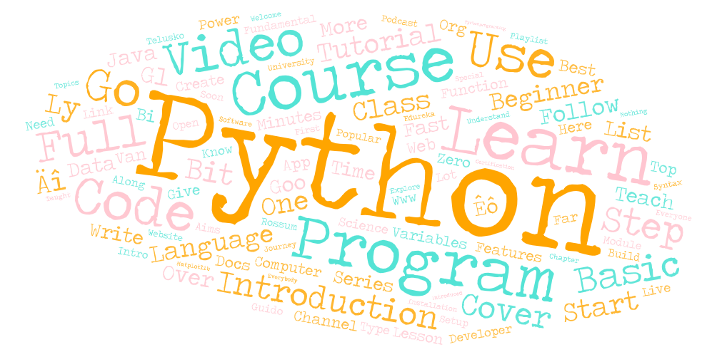

# Lab 2: Web data collection and visualization

### Topic and Search Parameters
The first area of study was Chinese cuisine, which has a long history dating back thousands of years and is characterized by a wide range of tastes, preparation methods, and regional differences. Word clouds for this subject include "Sichuan," "Noodle," "Street," "Wok," and "Hot," indicating that the topic is centered on hot food, cooking techniques, and the street food scene. The second subject included an overview of Python, a high-level interpreted programming language with a wide range of applications in fields including artificial intelligence, web development, and data analysis. Python is also noted for being readable. Word clouds with terms like "Code," "Learn," "Tutorial," "Video," and "Course" suggest that the subject is approached from an instructional and educational standpoint. For both subjects, the search criteria probably included well-known and often-used phrases from social media, forums, instructional materials, and publications about Chinese food and Python programming, respectively.

### Reason for Comparison
The purpose of the comparison is to examine the language and thematic differences between computer technology and cuisine, two very different professions. This contrast may highlight how language and terminology are used about cultural and technical topics, offering insight into how various fields of knowledge are debated and shared in public.

### Comparison of Word Clouds
Terms that bring up components, cultural settings, and sensory sensations abound in the word cloud for Chinese cuisine. Examples include "Ethnically," "Ingredients," and "Soup." On the other hand, terms like "Beginner," "Step," and "Basic" reflect the Python word cloud's emphasis on learning resources and methods. This implies that the discussion about Chinese food is about the experience and variety of the meal. Still, the discussion of Python is instructional and targeted at those who want to learn new abilities.

### Possible Reasons for Observed Patterns
The development of foodie culture on social media platforms such as Instagram and the popularity of culinary programs and food blogs may have an impact on the patterns in the Chinese food word cloud. The Python word cloud's focus on education-related terms is indicative of the language's standing as a user-friendly programming language for novices, as well as the wealth of Internet resources accessible for self-study and career advancement.

### Improvements for Future Research
To balance the casual tone represented by the word clouds, future studies might benefit from a more complex collection of data sources, such as journals, specialist forums, and expert reviews. Furthermore, using natural language processing methods to extract sentiment and context may help us comprehend these issues' debates more deeply.

### Observations and Stand-Out Points
It was surprising to see "Video" and "Course" dominate the Python word cloud; this might suggest that the programming community strongly favors video-based learning. The word "Ethically" sticks out in the Chinese food word cloud, perhaps indicating a rising concern about the ethics of food supply and consumption.

### WordCloud Images

### Link to download the CSV files
[Intro to Python](assets/search-result-1.csv "Python")
[Chinese Food](assets/search-result-2.csv "Chinese Food")

